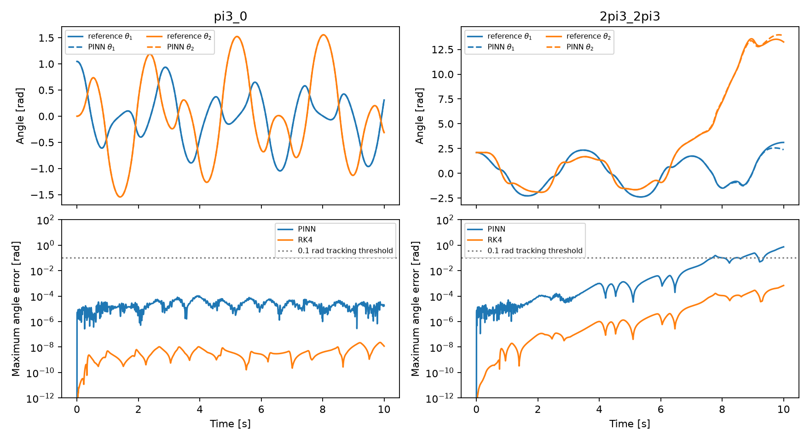

# Following a chaotic double pendulum with a PINN

Can a physics-informed neural network follow a chaotic double-pendulum trajectory? The PINN solves the equations in short time windows and is compared with a high-accuracy numerical reference and RK4.

## Setup

```sh
git clone https://github.com/Jhnnn001/chaotic-pinn.git
cd chaotic-pinn
conda env create -f environment.yml
conda activate chaotic-pinn
```

## Run

```sh
python test_project.py
python run.py
```

`dynamics.py` contains the equations and energy. `pinn.py` contains the time-marching PINN. `reference.py` contains DOP853, RK4, and Lyapunov calculations.

## Result

Both masses start at rest over 10 s; errors use unwrapped angles.
Tracking is lost when either angle error first exceeds 0.1 rad on the sampled grid.

| Initial angles | PINN maximum error [rad] | PINN error at 10 s [rad] | PINN tracking lost | RK4 maximum error [rad] |
|---|---:|---:|---|---:|
| (π/3, 0) | 1.05×10⁻⁴ | 1.72×10⁻⁵ | Not within 10 s | 2.31×10⁻⁸ |
| (2π/3, 2π/3) | 0.732 | 0.732 | 7.673 s | 6.79×10⁻⁴ |



The PINN tracks the low-energy comparison for the full interval but loses the
chaotic trajectory at 7.673 s; RK4 is more accurate and remains below the threshold.
PINN solve times were 325.5/310.0 s on an Apple M4 Pro with one CPU thread;
RK4 took 0.053/0.051 s, excluding reference and Lyapunov calculations.

The model uses point masses m₁=m₂=1 kg, massless rods L₁=L₂=1 m, g=9.8 m/s²,
and angles from the downward vertical.
Each 0.125 s window has a fresh 1→64→64→64→4 Tanh network, a hard initial
condition, and an ODE-residual plus energy loss (energy weight 1.0).
Training uses float64, seed 0 incremented per attempt, Adam 2,000 steps at
lr=0.001 with 256 resampled points, then L-BFGS up to 500 iterations;
the reference trajectory is not training data.
Windows above residual 0.001 are retried down to 0.015625 s, then rejected.

DOP853 at rtol=atol=10⁻¹² agrees with 10⁻¹³ to 10⁻⁶ rad at all 3,001 samples
through 10 s in both cases; RK4 uses dt=1/300 s.
If this reference check fails, that sample and subsequent reference-dependent
errors are censored, not interpreted as tracking results.
PINN maximum energy drift divided by the 29.4 J potential-energy amplitude
was 1.69×10⁻⁵/1.18×10⁻⁴ (the full potential-energy range is 58.8 J).
The 100/400 s finite-time Lyapunov estimates were 0.0417/0.0176 s⁻¹ and
1.537/1.419 s⁻¹; these are not universal prediction deadlines or proofs of
asymptotic regularity.

`results/metrics.json` records parameters, window residuals, runtimes, and
exact software versions; the two CSVs retain the sampled states and errors.
Production used Python 3.14.7, Torch 2.14.0, NumPy 2.5.3, SciPy 1.18.1, and
Matplotlib 3.11.2; the checks also pass on Python 3.11.
`run.py` overwrites these outputs and takes about 11 minutes for both cases.
One seed and two trajectories do not establish generalization, a rigorous
error bound, or statistical fidelity after tracking loss.

## References

- Wang, Sankaran, and Perdikaris, [Respecting causality for training physics-informed neural networks](https://arxiv.org/abs/2203.07404).
- Cabrera, Leonel, and Marti, [Regular and chaotic phase space fraction in the double pendulum](https://arxiv.org/abs/2312.13436).
- [SciPy DOP853 documentation](https://docs.scipy.org/doc/scipy/reference/generated/scipy.integrate.DOP853.html).
